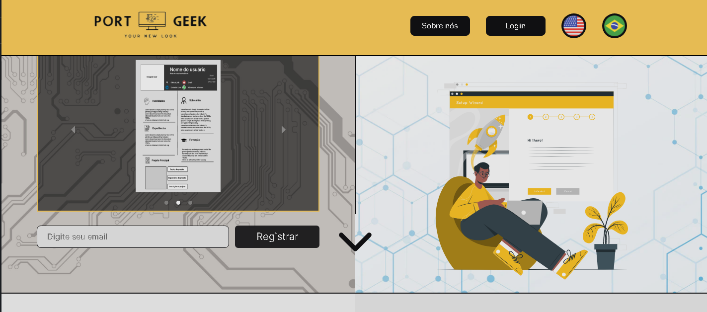
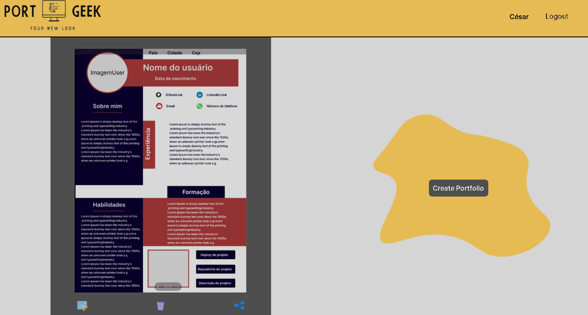

# Port Geek

# Sobre o projeto
Port Geek é um projeto acadêmico, desenvolvido em equipe, ele permite que usuários se cadastrem na plataforma para que possam gerar o seu próprio portfólio, podendo escolher dentre umas das 3 opções inicalmente adicionadas na aplicação.
Nossa aplicação, permite que o usuário adicione imagens de perfil, imagem de um projeto com seu respectivo link de deploy e repositório, este projeto será clickável quando o portfólio for gerado.

<a href="https://port-geek-main.vercel.app/">Visualizar projeto</a>

## Objetivo
A aplicação foi construída, pensando em passar uma ideia de layout para desenvolvedores que estão iniciando sua carreira como Dev, e possui dificuldades em pensar em quais informações adicionar em seu portfólio, e como seria a melhor forma de posicioná-los dentro de um Layout.

# Layout do projeto
## Página principal

Nesta página inicial, o usuário poderá fazer seu cadastro na plataforma, visualizar os layouts dispiníveis, alterar entre as linguagens Português e Inglês e visualizar os membros que participaram do projeto.

# Dashboard do projeto

Na dashboard do projeto, o usuário poderá cadastrar seu portfólio caso ainda não tenha feito, ele(a) poderá inserir as informações que serão adicionadas dinamicamente, além de poder adicionar um projeto de sua escolha, este projeto ecibirá um modal com as informações cadastradas e a imagem escolhida pelo usuário na hora da criação.

#Tecnologias utilizadas

<ul>
  <li>HTML/CSS/JavaScript</li>
  <li>React</li>
  <li>TypeScript</li>
  <li>React Hook Form</li>
  <li>React Router Dom</li>
  <li>Axios</li>
  <li>React Toastify</li>
  <li>Styled Components</li>
  <li>Yup</li>
</ul>

# Implantação em produção
<ul>
  <li>Vercel</li>
</ul>

# Autores
César Rafael
<a href="https://www.linkedin.com/in/cesarrafaeljunior/">Linkedin</a>
 
Henrique Sandim
<a href="https://www.linkedin.com/in/henrique-sandim-14992023a/">Linkedin</a>
 
Ariosvaldo Rodrigues
<a href="https://www.linkedin.com/in/arimoncaojr/">Linkedin</a>
 
Jalles Batista
<a href="https://www.linkedin.com/in/jallesbatista/">Linkedin</a>
 
Lucas Cruz
<a href="https://www.linkedin.com/in/lucascruzdesouza0103/">Linkedin</a>
 
